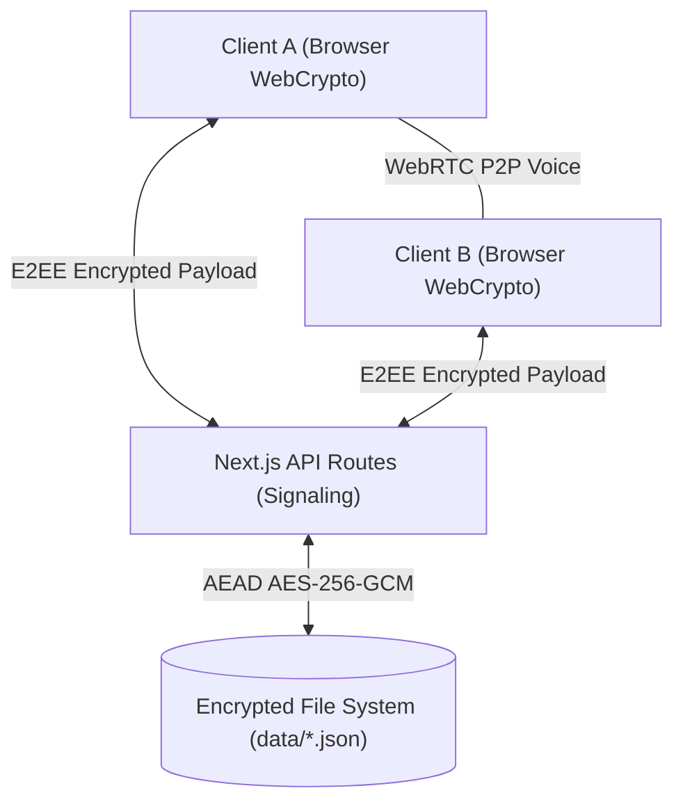

<div align="center">
  <h1>🛡️ Senfoni Chat</h1>
  <p><strong>A Next-Generation, E2EE Terminal-Based Messaging Platform</strong></p>
  <p>
    
    
    
    
  </p>
</div>

<br />

Senfoni Chat is an ultra-secure, terminal-styled messaging platform designed for privacy-conscious teams and individuals. Built with a Zero-Knowledge architecture, Senfoni Chat ensures that your communication remains completely confidential, utilizing both Client-Side End-to-End Encryption (E2EE) and robust Server-Side disk encryption.

## ✨ Core Features

*   🔒 **End-to-End Encryption (E2EE):** All messages are encrypted directly in the browser using AES-GCM-256 before being transmitted. The server never has access to plain text (Zero-Knowledge Principle).
*   🛡️ **AEAD Disk Encryption:** All server-side records (users, room hashes, presence logs) are encrypted at rest using server-managed AES-256-GCM.
*   🎙️ **P2P Voice Channels (Discord-style):** Independent voice and text channels. Chat in text channels while securely talking in P2P voice channels. *Note: TURN server integration is recommended to mask WebRTC IP addresses.*
*   💻 **Hacker/Retro Terminal Interface:** A distraction-free, pure Command Line Interface (CLI) experience with smart scrolling, command history, and custom syntax highlighting.
*   📱 **Mobile-Ready PWA:** Installable Progressive Web App with a responsive sidebar and touch-friendly interface for chatting on the go.
*   📝 **Private E2EE Notes:** A dedicated `notes-[username]` channel exclusively encrypted for your own keys.
*   ⚡ **Dynamic Setup Protocol:** Zero hardcoded keys. The system auto-generates server encryption configurations on first launch, ensuring maximum open-source safety.

---

## 🏗️ Architecture



---

## 🚀 Quick Start Guide

### 1. Installation

Ensure you have **Node.js 18+** installed on your system.

```bash
git clone https://github.com/mefkuz/senfoni-chat.git
cd senfoni-chat
npm install
npm run dev
```

Open your browser and navigate to `http://localhost:3000`.

### 2. Claiming the Server (First Run)

When you run Senfoni Chat for the first time, the database is completely empty and uninitialized. You must claim the server to become its primary administrator.

In the terminal UI, type:
```bash
/setup <your-username>
```

The system will generate a secure **Admin API Key** for you and lock the setup endpoint permanently. **Save this key!** It will not be shown again.

For future logins:
```bash
/login <your-api-key>
```

### 3. Creating Rooms and Inviting Users

As the administrator, you manage the platform:

*   **Create a user:** `/create-user alice` (The system will provide an API key for Alice).
*   **Create a text room:** `/create-room engineering`
*   **Create a voice room:** `/create-voice-room standup`

*When you create a room, the system generates a secure 12-character Room Key. Share this key with users so they can join.*

---

## 🔑 User Commands

| Command | Description |
| :--- | :--- |
| `/login [api-key]` | Authenticate your session (expires in 24h). |
| `/join [room] [key]` | Enter and decrypt a text channel. |
| `/leave` | Leave the current text channel. |
| `/join-voice [room] [key]`| Enter a P2P voice channel. |
| `/leave-voice` | Leave the active voice channel. |
| `/voice-mute` | Toggle your microphone on/off. |
| `/rooms` | List all available rooms. |
| `/whoami` | Display identity, roles, and active connections. |
| `/clear` | Clear the terminal screen buffer. |
| `/quit` | Terminate session and destroy local keys. |

---

## 🛡️ Security Best Practices

1.  **Session Storage:** Room keys are stored strictly in `sessionStorage` and are cleared immediately upon tab closure to prevent XSS exfiltration.
2.  **WebRTC Masking:** By default, P2P WebRTC connections may expose public IP addresses. It is strongly recommended to configure a STUN/TURN server (like `coturn`) in `src/hooks/useVoiceChat.ts` for absolute anonymity.
3.  **No Persistence on GitHub:** The `.gitignore` is strictly configured to ignore the `data/` directory. Your encrypted messages, keys, and configurations will never be pushed to version control.

(NOTE: its a vibe coding project)

---
<div align="center">
  <p><i>Developed with security and elegance in mind.</i></p>
</div>
